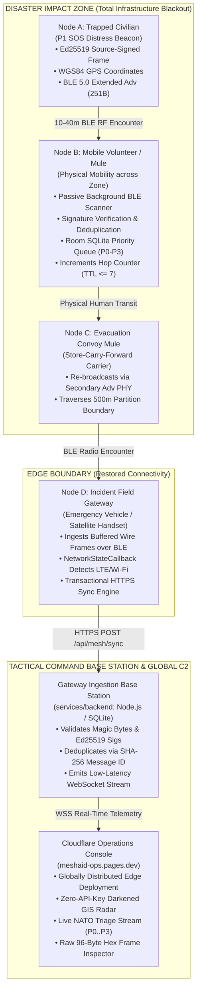

# MeshAid

**Zero-Infrastructure Opportunistic Delay-Tolerant Mesh Network & Tactical Emergency Incident Command System**

[](https://meshaid-ops.pages.dev)
[](#)
[-3DDC84?logo=android&logoColor=white)](#)
[-0082FC?logo=bluetooth&logoColor=white)](#standardized-cryptographic-wire-protocol-specification)
[](#cryptographic-wire-specification)
[](LICENSE)
[-333333)](#)

---

## 1. Concrete Problem Statement: Infrastructure Collapse in Crisis Scenarios

During catastrophic natural disasters (catastrophic earthquakes, Category 5 cyclones, tsunami inundation, and regional grid collapse) or wartime disruptions, centralized telecommunications infrastructures experience immediate, systemic failure:

```
+-----------------------------------------------------------------------------------------------+
|                             CASCADE INFRASTRUCTURE FAILURE TIMELINE                           |
|                                                                                               |
|  [ T = 0h: Disaster Impact ]                                                                  |
|    └─ High-voltage power transmission lines trip; utility substation grid blackouts occur.    |
|                                                                                               |
|  [ T + 2h..12h: Cell Tower Blackout ]                                                         |
|    └─ Cellular Base Transceiver Stations (BTS) deplete backup Lead-Acid / LiFePO4 batteries.  |
|    └─ Diesel generators fail due to submerged fuel tanks or blocked municipal supply routes.  |
|                                                                                               |
|  [ T + 12h..24h: Physical Backhaul & Backbone Shear ]                                         |
|    └─ Terrestrial fiber conduits severed by ground displacement, landslides, or flooding.    |
|                                                                                               |
|  [ T + 24h+: Core DNS & Routing Table Annihilation ]                                          |
|    └─ ISP authoritative nameservers, captive portals, and gateway routing fail.              |
|    └─ Standard mobile applications (WhatsApp, Telegram, Emergency SMS) fail instantaneously. |
|    └─ THE COMMUNICATION VOID: Civilians & field responders are within acoustic proximity      |
|       (50m - 1000m) but rendered 100% digitally invisible and unable to coordinate relief.   |
+-----------------------------------------------------------------------------------------------+
```

### Why Existing Emergency Alternatives Fall Short
1. **Satellite Terminals (Starlink, Iridium, Garmin inReach):** Prohibitively expensive, bulky, require unobstructed line-of-sight to the sky, and are virtually non-existent in the pockets of trapped civilians.
2. **Dedicated Sub-GHz LoRa Radios (Meshtastic, APRS):** Require specialized external microcontrollers (ESP32/nRF52) and Semtech SX1262 transceivers. Civilians cannot procure hardware dongles when an unanticipated disaster strikes.
3. **Traditional Ad-Hoc / Wi-Fi Mesh Networks:** High power consumption drains smartphone batteries within hours; aggressive radio association handshakes fail under dense RF mobility.

### The MeshAid Solution
MeshAid democratizes disaster communications by transforming commercial off-the-shelf (**COTS**) Android smartphones into autonomous, delay-tolerant mesh nodes. Operating over uncoordinated **Bluetooth Low Energy (BLE) 5.0 Extended Advertisements**, MeshAid operates with **zero cellular connectivity, zero internet access, zero SIM card dependencies, and zero specialized hardware**.

---

## 2. End-to-End Network Topology

MeshAid employs **Delay-Tolerant Networking (DTN)** powered by **Store-Carry-Forward** routing. When network partitions prevent real-time routing, mobile humans (civilians, search-and-rescue teams, medical volunteers) serve as physical "data mules," buffering cryptographically secured telemetry and bridging partitioned geographical clusters.

### Mermaid Architectural Topology


### ASCII Physical Encounter Topology
```
+----------------------------------------------------------------------------------------------------+
|                                  DISASTER IMPACT ZONE (OFFLINE)                                    |
|                                                                                                    |
|  [ Node A: Victim SOS ]                                                                            |
|  - Encodes 96-Byte Binary Header + Incident JSON Payload                                           |
|  - Signs canonical pre-image via private Ed25519 Key                                               |
|  - Transmits via BLE 5.0 Extended Advertising (PHY_LE_1M / Non-Connectable)                        |
|         |                                                                                          |
|         | (10-40m RF Encounter / Zero Infrastructure / No Cellular)                                 |
|         v                                                                                          |
|  [ Node B: Mobile Data Mule (Evacuee / Paramedic) ]                                                |
|  - Ingests wire frame via native Android BluetoothLeScanner                                        |
|  - Verifies Ed25519 public signature against packet integrity pre-image                            |
|  - Stores in Room SQLite Priority Queue: P0 (Auth) > P1 (SOS) > P2 (Logistics) > P3 (Info)         |
|  - Physical transit across physical terrain obstacle (Store-Carry-Forward)                         |
|  - Increments Hop Count (drops if >= 7) and re-advertises to nearby nodes                          |
+----------------------------------------------------------------------------------------------------+
                                           |
                                           | Physical Mobility across partition boundary
                                           v
+----------------------------------------------------------------------------------------------------+
|                                    EDGE RESTORATION ZONE                                           |
|                                                                                                    |
|  [ Node C: Field Gateway Handset / Incident Vehicle ]                                              |
|  - Ingests buffered frames over BLE encounter with Node B                                          |
|  - ConnectivityManager detects active satellite/LTE backhaul link                                  |
|  - Flushes queued frames via transactional HTTP POST Base64 payload                                |
+----------------------------------------------------------------------------------------------------+
                                           |
                                           | HTTPS POST /api/mesh/sync
                                           v
+----------------------------------------------------------------------------------------------------+
|                               GLOBAL OPERATIONS BASE STATION & C2                                  |
|                                                                                                    |
|  [ services/backend: Ingestion Base Station ]                                                      |
|  - Decodes binary wire frames; validates Magic Bytes (0x4D 0x41) and Ed25519 signatures            |
|  - SHA-256 deduplication and SQLite telemetry persistence                                          |
|  - Dispatches WebSocket events (EVENT_NEW_INCIDENT) to connected C2 clients                        |
|         |                                                                                          |
|         | WebSocket Event Pipeline                                                                 |
|         v                                                                                          |
|  [ Cloudflare Operations Console: https://meshaid-ops.pages.dev ]                                  |
|  - Static edge deployment on Cloudflare Pages (meshaid-ops)                                        |
|  - High-contrast tactical GIS radar with custom dark-filtered OpenStreetMap tiles                  |
|  - Real-time casualty/triage KPI aggregation and raw byte-level frame inspector                    |
+----------------------------------------------------------------------------------------------------+
```

---

## 3. Standardized Cryptographic Wire Protocol Specification

MeshAid packets are engineered to fit inside the **251-byte maximum advertising data payload** permitted by the **Bluetooth Core Specification v5.0+ LE Extended Advertising** standard (or degraded into indexed chunks on legacy BLE 4.x hardware).

All multi-byte numeric fields are encoded in **Big-Endian (Network Byte Order)**. All floating-point fields strictly conform to the **IEEE 754-2008 single-precision 32-bit format**.

### Complete 251-Byte Wire Frame Budget & Header Layout

| Byte Offset | Size | Field Name | Data Type | Encoding / Endianness | Protocol & Cryptographic Function |
| :--- | :--- | :--- | :--- | :--- | :--- |
| `00..01` | 2B | **Magic Framing Bytes** | `0x4D 0x41` | Big-Endian (ASCII `"MA"`) | Hardware-level frame sync. Packets without this prefix are discarded in kernel space before parsing. |
| `02` | 1B | **Protocol Version** | `UInt8` | Binary (`0x01`) | Identifies protocol release version. Incompatible versions are rejected immediately. |
| `03` | 1B | **Packet Type / Priority** | `UInt8` | Binary Enum (`0x00..0x03`) | `0x00` = P0 (Authority), `0x01` = P1 (Civilian SOS), `0x02` = P2 (Logistics), `0x03` = P3 (General Info). |
| `04..05` | 2B | **TTL Hop Counter** | `UInt16` | Big-Endian UInt16 | Monotonically incremented at each relay hop. Dropped if $\ge 7$ to eliminate network routing loops. |
| `06..13` | 8B | **Message ID / Author Slice** | `8 Bytes` | Truncated SHA-256 | Cryptographic fingerprint slice of author public key, timestamp, and payload. Used for deduplication. |
| `14..17` | 4B | **Epoch Timestamp** | `UInt32` | Big-Endian UInt32 | UTC timestamp in epoch seconds when the packet was authored at the origin node. |
| `18..21` | 4B | **Time-To-Live (TTL)** | `UInt32` | Big-Endian UInt32 | Validity duration in seconds. Dropped when $\text{Epoch}_{\text{now}} \ge \text{Timestamp} + \text{TTL}$. |
| `22..25` | 4B | **WGS84 Latitude** | `Float32` | IEEE 754 Big-Endian | Latitude coordinate of victim encounter (`0x7FC00000` / `Float.NaN` if GPS locked unavailable). |
| `26..29` | 4B | **WGS84 Longitude** | `Float32` | IEEE 754 Big-Endian | Longitude coordinate of victim encounter (`0x7FC00000` / `Float.NaN` if GPS locked unavailable). |
| `30..31` | 2B | **Payload Length ($N$)** | `UInt16` | Big-Endian UInt16 | Byte length $N$ of trailing incident payload ($0 \le N \le 155$ in single-packet BLE frame; up to 65,535 in multi-chunk sessions). |
| `32..95` | 64B | **Ed25519 Signature** | `64 Bytes` | Raw Binary Signature | Cryptographic signature generated by the author's private key covering bytes `00..31` concatenated with the payload. |
| `96..250`| $N$ B | **Incident Payload** | `Binary / JSON` | UTF-8 Encoded String | Compact structured incident telemetry: casualty count, trapped status, urgent medical/water needs, and sector ID. |

### Extended Advertising Budget Breakdown
```
Total BLE 5.0 Extended Advertising Frame Budget: 251 Bytes
├── [00..31] Fixed Header Metadata   :  32 Bytes ( 12.7% )
├── [32..95] Ed25519 Signature       :  64 Bytes ( 25.5% )  <-- Fixed Header Total: 96 Bytes (38.2%)
└── [96..250] Single-Frame Payload   : 155 Bytes ( 61.8% )  <-- Telemetry Budget
```

### Cryptographic Signable Pre-Image Formula
To guarantee immutable integrity across untrusted relay nodes, the signature pre-image binds the framing, priority, origin, hops, timestamp, coordinates, and payload:

$$\text{PreImage} = \text{Header}[00..31] \mathbin{\Vert} \text{Payload}[0..N-1]$$

The signature $\sigma$ is verified using the author's Ed25519 public key $K_{\text{pub}}$:

$$\text{Verify}(K_{\text{pub}}, \text{PreImage}, \sigma) \equiv \text{True}$$

Any unauthorized alteration of geographic coordinates, TTL hop limits, priority tiers, or incident payload by intermediary nodes immediately invalidates the signature, triggering instantaneous dropped packet rejection.

---

## 4. Technology Stack Breakdown

### Android Mobile Client (`apps/mobile`)
- **Language & Runtime:** Kotlin 2.0+ targeting Java 17 and Android 12+ (API Level 31 to 34).
- **Asynchronous Concurrency:** Kotlin Coroutines (`Dispatchers.IO`) & `StateFlow` for non-blocking RF advertisement processing.
- **User Interface:** Jetpack Compose with Material 3. Engineered with an ultra-high-contrast tactical dark theme to conserve battery on AMOLED displays during power outages.
- **Local Persistence & Priority Eviction:** Room SQLite database. Implements deterministic retrieval queues (`ORDER BY priority ASC, createdAt DESC`) and automatic LRU eviction under storage quotas (dropping P3/P2 records to protect P1 Civilian SOS).
- **Cryptographic Security:** Android Security & Java Cryptography Architecture (JCA) with native Ed25519 key generation and signature verification.
- **Bluetooth Low Energy Engine:**
  - `BluetoothLeAdvertiser`: Configured for BLE 5.0 Extended Advertising (`AdvertisingSetParameters` with `PHY_LE_1M` / `PHY_LE_CODED`, non-connectable, up to 251-byte advertising PDU) with automatic fallback to 24-byte chunking on legacy BLE 4.x chipsets.
  - `BluetoothLeScanner`: High-duty cycle scanning in the foreground, transitioning to power-optimized interval scanning in the background.
- **OEM Background Hardening:** Persistent Foreground Service (`FOREGROUND_SERVICE_TYPE_CONNECTED_DEVICE`), partial CPU `WakeLock` during active scanning bursts, and automated battery optimization exemption requests to survive aggressive OEM task killers (OneUI, MIUI).

### Tactical Incident Command Dashboard (`apps/dashboard`)
- **Framework & Build:** React 18 with TypeScript 5.7 and Vite 5.
- **Edge Deployment:** **Cloudflare Pages** (`meshaid-ops.pages.dev`) with sub-50ms global Time-To-First-Byte (TTFB).
- **Tactical GIS Radar:** Leaflet with dark-filtered OpenStreetMap raster tiles (using custom CSS filters: `invert(100%) hue-rotate(180deg) contrast(120%)`), eliminating any dependency on third-party cloud mapping APIs.
- **Operational C2 Stream:** Real-time WebSocket connection to ingestion base station, live casualty aggregation, NATO priority triage badges (`[P0:CRIT]`, `[P1:SOS]`, `[P2:LOG]`, `[P3:INF]`), and a raw 96-byte hex frame inspector.

### Ingestion Gateway Base Station (`services/backend`)
- **Runtime:** Node.js 20 LTS + TypeScript.
- **Endpoints:** REST API (`POST /api/mesh/sync`) for opportunistic field uploads and WebSocket server for real-time dispatch to C2 consoles.
- **Storage:** SQLite engine with automated SHA-256 deduplication and transaction-safe telemetry logging.

---

## 5. Repository Monorepo Structure

```
MeshAid/
├── apps/
│   ├── dashboard/             # Tactical Incident Command C2 Interface (React + Vite + TS)
│   │   ├── public/            # Static assets, _redirects, _headers for Cloudflare Pages
│   │   ├── src/components/    # TacticalMap, IncidentCard, TriageKpiRow, HexDumpInspector
│   │   ├── wrangler.toml      # Cloudflare Pages deployment configuration (meshaid-ops)
│   │   └── package.json       # Build and deployment scripts (wrangler pages deploy)
│   │
│   └── mobile/                # Native Android (Kotlin) DTN Mesh Node Application
│       ├── app/src/main/      # BleService, Room Database, ChunkReassembler, UplinkWorker
│       └── build.gradle.kts   # Android 12+ SDK 34, Jetpack Compose, Room persistence
│
├── packages/
│   └── protocol/              # TypeScript 96-byte wire codec, Ed25519 signing & verification
│       ├── src/               # Codec implementation, priority types, bitwise helpers
│       └── test/              # 3-node store-carry-forward test suite & boundary checks
│
├── services/
│   └── backend/               # Ingestion Base Station Server (Node.js + Express + WebSocket)
│       ├── src/               # /api/mesh/sync ingestion, SQLite store, WSS broadcast
│       └── Dockerfile         # Multi-stage Node 20 container
│
├── docker-compose.yml         # One-click multi-container base station stack
├── LICENSE                    # MIT Open Source License
└── README.md                  # System specification & runbook
```

---

## 6. Quickstart: Build, Test & Deployment Runbook

### A. Web Operations Dashboard (`apps/dashboard`)

The dashboard is configured for direct deployment to **Cloudflare Pages** under project `meshaid-ops`.

#### Local Development
```bash
# Navigate to dashboard workspace
cd apps/dashboard

# Install dependencies
npm install

# Start local development server (http://localhost:5173)
npm run dev
```

#### Production Build & Cloudflare Pages Deployment
```bash
# Compile TypeScript and bundle production static assets into dist/
npm run build

# Direct deployment to Cloudflare Pages via Wrangler
npx wrangler pages deploy dist --project-name meshaid-ops

# Or execute via dashboard package script
npm run deploy:pages
```

Production deployment URL: **[https://meshaid-ops.pages.dev](https://meshaid-ops.pages.dev)**

---

### B. Native Android Mobile Application (`apps/mobile`)

#### Prerequisites
- JDK 17 (Eclipse Temurin or OpenJDK)
- Android SDK with Platform 34 and Build-Tools 34.0.0
- Physical Android test handset (Android 12+, API 31+) with BLE 5.0 support

#### Compile Debug APK
```bash
# Navigate to mobile project directory
cd apps/mobile

# Build debug APK via Gradle wrapper
# Windows:
.\gradlew.bat assembleDebug

# Linux / macOS:
./gradlew assembleDebug

# Output APK location:
# apps/mobile/app/build/outputs/apk/debug/app-debug.apk
```

#### Sideloading & ADB Permission Grants
```bash
# Sideload the APK to a connected Android handset
adb install -r apps/mobile/app/build/outputs/apk/debug/app-debug.apk

# Grant required runtime permissions for BLE Advertising, Scanning, and GPS
adb shell pm grant dev.meshaid.app android.permission.BLUETOOTH_SCAN
adb shell pm grant dev.meshaid.app android.permission.BLUETOOTH_ADVERTISE
adb shell pm grant dev.meshaid.app android.permission.BLUETOOTH_CONNECT
adb shell pm grant dev.meshaid.app android.permission.ACCESS_FINE_LOCATION
adb shell pm grant dev.meshaid.app android.permission.ACCESS_COARSE_LOCATION
adb shell pm grant dev.meshaid.app android.permission.POST_NOTIFICATIONS

# Whitelist application from Android Doze / Battery Optimization
adb shell dumpsys deviceidle whitelist +dev.meshaid.app
```

---

### C. Protocol Package & Ingestion Backend

```bash
# 1. Validate Protocol Wire Codec Tests
cd packages/protocol
npm install
npm test

# 2. Launch Ingestion Gateway Server
cd ../../services/backend
npm install
npm run build
npm start

# 3. Execute End-to-End Synthetic Telemetry Harness
npm run test:e2e
```

---

### D. One-Click Base Station (Docker Compose)

Deploy the entire base station stack (Ingestion API, SQLite database, WebSocket server, and Tactical C2 Console) locally:

```bash
docker compose up --build -d
```
- **Operations Console:** [http://localhost](http://localhost) (or port `5173`)
- **Backend API:** [http://localhost:3000](http://localhost:3000)
- **Healthcheck Endpoint:** `curl http://localhost:3000/api/health`

---

## 7. Operational Boundaries & Physical Realities

| Dimension | MeshAid (This Architecture) | Meshtastic | Bridgefy / Briar |
| :--- | :--- | :--- | :--- |
| **Physical RF Layer** | Standard 2.4 GHz BLE 5.0 (COTS Handsets) | Sub-GHz LoRa (433 / 868 / 915 MHz) | Wi-Fi Direct / Hybrid BLE |
| **Hardware Barrier** | **Zero External Hardware** (Standard Smartphone) | High (Requires dedicated ESP32 + SX1262) | Zero External Hardware |
| **Single-Hop Range** | **10 – 40 meters** line-of-sight | **2 – 15+ kilometers** line-of-sight | **10 – 60 meters** |
| **Routing Model** | **Store-Carry-Forward DTN** (Human Mobility) | Flood Routing / Managed Mesh | Epidemic Routing / Wi-Fi Clusters |
| **Cryptography** | **Source-Signed Ed25519** + SHA-256 Frame IDs | Pre-Shared AES-256 / Ed25519 | Tor Onion / TLS P2P |
| **Mass Civilian Usability** | **Immediate** (Instantly installable APK) | Low (Requires pre-provisioned transceivers) | Medium (Pre-installed app required) |

### Engineering Considerations & Failure Mitigations
1. **RF Absorption in Structural Debris:** 2.4 GHz BLE signals experience severe attenuation through reinforced concrete, wet soil, and masonry rubble. MeshAid does not assume continuous direct radio links across kilometers; it relies on **physical movement of human carriers** carrying cached records across barrier zones.
2. **Advertising Channel Contention:** High density of broadcasting nodes on BLE primary advertising channels (37, 38, 39) can cause packet collisions. MeshAid implements randomized transmission jitter (300ms - 800ms) and utilizes secondary advertising channels (`PHY_LE_1M` / `PHY_LE_CODED`) on supported BLE 5.0 chipsets.
3. **Aggressive OEM Task Management:** Customized Android skins (Samsung OneUI, Xiaomi HyperOS) enforce strict background thread throttles. MeshAid counters this via Foreground Services, partial CPU `WakeLock` allocation during active scan cycles, and explicit system battery optimization whitelisting.

---

## 8. License

This project is licensed under the terms of the **MIT License**. See [LICENSE](LICENSE) for full legal text.
