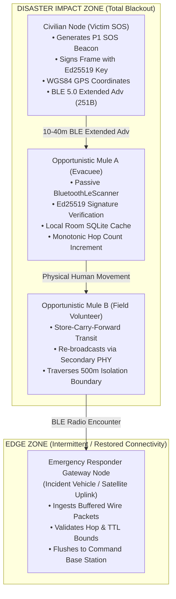

# MeshAid

**Zero-Infrastructure Decentralized Emergency Mesh Network for Android**

[](#)
[-3DDC84?logo=android&logoColor=white)](#)
[-0082FC?logo=bluetooth&logoColor=white)](#standardized-cryptographic-wire-protocol-specification)
[](#cryptographic-wire-specification)
[](LICENSE)
[-333333)](#)

---

## 1. Threat Scenario & The Core Problem

During catastrophic crises—major earthquakes, Category 5 hurricanes, severe flash flooding, or widespread power grid blackouts—centralized telecommunication infrastructures suffer immediate, cascading failure:

```
+-----------------------------------------------------------------------------------------------+
|                            CASCADING TELECOM COLLAPSE TIMELINE                                |
|                                                                                               |
|  [ T = 0h: Disaster Impact ]                                                                  |
|    └─ High-voltage power transmission lines trip; utility substation grid blackouts occur.    |
|                                                                                               |
|  [ T + 2h..12h: Cell Tower Blackout ]                                                         |
|    └─ Cellular Base Transceiver Stations (BTS) exhaust backup Lead-Acid / LiFePO4 batteries.  |
|    └─ Diesel backup generators fail due to flooded fuel tanks or blocked municipal roads.     |
|                                                                                               |
|  [ T + 12h..24h: Physical Backhaul Severance ]                                                |
|    └─ Fiber-optic terrestrial lines severed by tectonic shear, ground collapse, or landslides.|
|                                                                                               |
|  [ T + 24h+: Core DNS & Gateway Routing Annihilation ]                                        |
|    └─ Authoritative nameservers, captive portals, and ISP routing tables go dark.             |
|    └─ Standard messaging apps (WhatsApp, Signal, Telegram) fail instantaneously.             |
|    └─ THE COMMUNICATION VOID: Trapped civilians and field responders are within acoustic      |
|       distance (50m - 500m) but completely digitally isolated and unable to coordinate.     |
+-----------------------------------------------------------------------------------------------+
```

### Why Existing Solutions Fail in Crisis Scenarios
1. **Satellite Messengers (Starlink, Garmin inReach, Iridium):** Prohibitively expensive, require clear line-of-sight to the sky, and are virtually absent from the pockets of average civilians trapped in damaged structures.
2. **Dedicated Sub-GHz LoRa Radios (Meshtastic, APRS):** Require specialized external microcontrollers (ESP32/nRF52) and Semtech SX1262 transceivers. Civilians cannot obtain custom hardware dongles after disaster strikes.
3. **Wi-Fi Direct / Ad-Hoc Meshes:** Continuous active radio connections deplete smartphone batteries within hours, and complex pairing handshakes fail in mobile, dynamic environments.

### The MeshAid Paradigm
MeshAid transforms commercial off-the-shelf (**COTS**) Android smartphones into autonomous, delay-tolerant mesh communication nodes. Using uncoordinated **Bluetooth Low Energy (BLE) 5.0 Extended Advertisements**, MeshAid operates with **zero cellular service, zero internet access, zero SIM card dependencies, and zero external hardware**.

---

## 2. Architecture & Delay-Tolerant Networking (DTN) Model

MeshAid implements **Delay-Tolerant Networking (DTN)** using an opportunistic **Store-Carry-Forward** routing topology. When network partitions separate disaster zones, mobile civilians, volunteers, and emergency personnel act as physical "data mules," carrying cryptographically signed emergency telemetry and exchanging packets whenever they come within radio range of other nodes.

### Mermaid Network Topology


### ASCII Encounter Diagram
```
+----------------------------------------------------------------------------------------------------+
|                                  DISASTER IMPACT ZONE (OFFLINE)                                    |
|                                                                                                    |
|  [ Node A: Civilian Distress SOS ]                                                                 |
|  - Encodes 96-Byte Binary Header + Incident Telemetry Payload                                      |
|  - Cryptographically signs frame using device's Ed25519 Private Key                                |
|  - Broadcasts via BLE 5.0 Extended Advertising (PHY_LE_1M / Non-Connectable)                       |
|         |                                                                                          |
|         | (10-40m RF Encounter / No Infrastructure / No Cellular)                                  |
|         v                                                                                          |
|  [ Node B: Mobile Data Mule (Evacuee / Paramedic Handset) ]                                        |
|  - Ingests wire frame via native Android BluetoothLeScanner                                        |
|  - Cryptographically validates Ed25519 signature against pre-image                                 |
|  - Stores in Room SQLite Priority Cache: P0 (Auth) > P1 (SOS) > P2 (Logistics) > P3 (Info)         |
|  - Physical transit across terrain obstacles (Store-Carry-Forward)                                 |
|  - Increments Hop Count (drops if >= 7) and re-advertises to nearby peers                          |
+----------------------------------------------------------------------------------------------------+
                                           |
                                           | Physical Mobility across partition boundary
                                           v
+----------------------------------------------------------------------------------------------------+
|                                    EDGE RESTORATION ZONE                                           |
|                                                                                                    |
|  [ Node C: Emergency Responder Gateway Node (Incident Vehicle / Satellite Terminal) ]              |
|  - Ingests cached wire frames over BLE encounter with Node B                                       |
|  - NetworkStateCallback detects active satellite/LTE backhaul                                      |
|  - Flushes queued telemetry frames via transactional Base64 payload to Incident Command            |
+----------------------------------------------------------------------------------------------------+
```

---

## 3. Standardized Cryptographic Wire Protocol Specification

MeshAid packets are designed to fit inside the **251-byte maximum advertising data payload** permitted by the **Bluetooth Core Specification v5.0+ LE Extended Advertising** standard (with seamless fallback to 24-byte chunked frames on legacy BLE 4.x hardware).

All multi-byte numeric fields are encoded in **Big-Endian (Network Byte Order)**. Floating-point coordinates strictly conform to the **IEEE 754-2008 single-precision 32-bit format**.

### Complete 251-Byte Wire Frame Budget & Header Layout

| Byte Offset | Size | Field Name | Data Type | Encoding / Endianness | Protocol & Cryptographic Function |
| :--- | :--- | :--- | :--- | :--- | :--- |
| `00..01` | 2B | **Magic Framing Bytes** | `0x4D 0x41` | Big-Endian (ASCII `"MA"`) | Hardware-level frame filter. Non-MeshAid packets are discarded immediately before parsing. |
| `02` | 1B | **Protocol Version** | `UInt8` | Binary (`0x01`) | Wire format version tracking. Incompatible revisions are rejected. |
| `03` | 1B | **Priority Flag / Type** | `UInt8` | Binary Enum (`0x00..0x03`) | `0x00` = P0 (Authority), `0x01` = P1 (Civilian SOS), `0x02` = P2 (Logistics), `0x03` = P3 (General Info). |
| `04..05` | 2B | **TTL Hop Counter** | `UInt16` | Big-Endian UInt16 | Monotonically incremented at each relay hop. Dropped if $\ge 7$ to eliminate routing loops. |
| `06..13` | 8B | **Message ID / Author** | `8 Bytes` | Truncated SHA-256 | Unique message identifier and public key fingerprint slice used for deduplication. |
| `14..17` | 4B | **Epoch Timestamp** | `UInt32` | Big-Endian UInt32 | UTC timestamp in epoch seconds when the packet was created at the origin node. |
| `18..21` | 4B | **Time-To-Live (TTL)** | `UInt32` | Big-Endian UInt32 | Validity duration in seconds. Dropped when $\text{Epoch}_{\text{now}} \ge \text{Timestamp} + \text{TTL}$. |
| `22..25` | 4B | **WGS84 Latitude** | `Float32` | IEEE 754 Big-Endian | Latitude coordinate of victim encounter (`0x7FC00000` / `Float.NaN` if GPS locked unavailable). |
| `26..29` | 4B | **WGS84 Longitude** | `Float32` | IEEE 754 Big-Endian | Longitude coordinate of victim encounter (`0x7FC00000` / `Float.NaN` if GPS locked unavailable). |
| `30..31` | 2B | **Payload Length ($N$)** | `UInt16` | Big-Endian UInt16 | Byte length $N$ of trailing incident payload ($0 \le N \le 155$ in single-packet BLE frame). |
| `32..95` | 64B | **Ed25519 Signature** | `64 Bytes` | Raw Binary Signature | Cryptographic signature generated by author's private key covering bytes `00..31` + payload. |
| `96..250`| $N$ B | **Incident Payload** | `Binary / JSON` | UTF-8 Encoded String | Structured telemetry: headcount, trapped status, urgent medical/water needs, and sector ID. |

### Extended Advertising Budget Breakdown
```
Total BLE 5.0 Extended Advertising Frame Budget: 251 Bytes
├── [00..31] Fixed Header Metadata   :  32 Bytes ( 12.7% )
├── [32..95] Ed25519 Signature       :  64 Bytes ( 25.5% )  <-- Fixed Header Total: 96 Bytes (38.2%)
└── [96..250] Single-Frame Payload   : 155 Bytes ( 61.8% )  <-- Telemetry Budget
```

### Cryptographic Signable Pre-Image Formula
To guarantee immutable integrity across untrusted relay nodes, the signature pre-image binds the framing, priority, origin, hops, timestamp, coordinates, and payload:

$$\text{PreImage} = \text{Header}[00..31] \mathbin{\Vert} \text{Payload}[0..N-1]$$

The signature $\sigma$ is verified using the author's Ed25519 public key $K_{\text{pub}}$:

$$\text{Verify}(K_{\text{pub}}, \text{PreImage}, \sigma) \equiv \text{True}$$

Any unauthorized alteration of geographic coordinates, TTL hop limits, priority tiers, or incident payload by intermediary nodes immediately invalidates the signature, triggering instantaneous dropped packet rejection.

---

## 4. Android Architecture Breakdown

The MeshAid Android client is built strictly on modern Android architecture patterns (Kotlin, Jetpack Compose, Room SQLite, Coroutines, and native BLE services):

```
app/src/main/java/dev/meshaid/app/
├── ble/                               # Hardware Bluetooth Low Energy Subsystem
│   ├── BleAdvertiserManager.kt        # BLE 5.0 Extended Advertising + 24B legacy chunking fallback
│   ├── BleScannerManager.kt           # Background/Foreground BLE scanning & encounter callbacks
│   └── BleConstants.kt                # Service UUIDs, manufacturer IDs, and advertising limits
│
├── data/                              # Data Persistence & Repository Layer
│   ├── local/                         # Room SQLite database implementation
│   │   ├── MeshAidDatabase.kt         # ACID Room database configuration
│   │   ├── dao/MeshAidDao.kt          # Priority-sorted queries & deduplication checks
│   │   └── entity/                    # Message & SeenPacket database entities
│   └── MeshAidRepository.kt           # Central repository mediating between BLE, DB, and UI
│
├── protocol/                          # Wire Protocol & Cryptography Engine
│   └── MeshAidPacketCodec.kt          # 96-byte binary encoder/decoder & Ed25519 signer/verifier
│
├── service/                           # OEM Background Execution Hardening
│   └── MeshRelayService.kt            # Foreground Service with WakeLock & battery optimization
│
├── ui/                                # Presentation Layer (Jetpack Compose)
│   ├── MainActivity.kt                # App entrypoint & runtime permission orchestrator
│   ├── RelayDashboardScreen.kt        # Tactical high-contrast dark theme HUD & incident triage feed
│   ├── SosDispatchDialog.kt           # One-tap emergency broadcast modal
│   └── EmergencyViewModel.kt          # StateFlow reactive state management
│
└── util/                              # System Utilities
    └── BatteryOptimizationHelper.kt   # System Doze bypass and OEM battery whitelist requests
```

### Key Technical Subsystems

1. **Jetpack Compose UI Layer:**
   - Designed with an ultra-high-contrast tactical dark theme to conserve battery on AMOLED displays during power grid blackouts.
   - Large tactile action buttons for single-handed operation under severe physical stress.
   - NATO-standard triage priority indicators (`[P0:CRIT]`, `[P1:SOS]`, `[P2:LOG]`, `[P3:INF]`).

2. **Room SQLite Persistence Engine:**
   - Deterministic retrieval queues ordered strictly by urgency: `ORDER BY priority ASC, createdAt DESC`.
   - Automatic duplicate suppression via `SeenPacketEntity` (SHA-256 message ID matching).
   - Dynamic memory-pressure eviction: under device storage quotas (10,000 records), low-priority records (`P3` and `P2`) are purged to preserve `P1 Civilian SOS` and `P0 Authority` frames.

3. **Cryptographic Signing Pipeline:**
   - Native Java Cryptography Architecture (JCA) using `Ed25519` key generation and verification.
   - BouncyCastle / Tink compatible binary formatting.
   - Tamper-evident packet pre-image verification prevents malicious packet alteration during relay.

4. **Background BLE Radio Lifecycle:**
   - `BluetoothLeAdvertiser`: Utilizes BLE 5.0 Extended Advertising (`AdvertisingSetParameters` with `PHY_LE_1M` / `PHY_LE_CODED`, non-connectable, up to 251-byte advertising PDU) with automatic fallback to 24-byte chunked frames on legacy hardware.
   - `BluetoothLeScanner`: High-duty cycle scanning when active, transitioning to low-latency interval scanning in background.
   - Android Foreground Service with `FOREGROUND_SERVICE_TYPE_CONNECTED_DEVICE`, partial CPU `WakeLock`, and Doze exemption to survive OEM task termination (OneUI, HyperOS).

---

## 5. Build, Test & Sideload Guide

### Prerequisites
- **Java Development Kit:** OpenJDK 17 or Eclipse Temurin 17 (or JDK 21)
- **Android SDK:** Platform API 34 and Build-Tools 34.0.0
- **Physical Test Device:** Android handset running Android 12+ (API Level 31+) with BLE 5.0 support

---

### Compile Debug APK via Gradle

#### Linux / macOS:
```bash
# Grant execution permissions to Gradle wrapper
chmod +x gradlew

# Run unit test suite
./gradlew testDebugUnitTest

# Assemble debug APK
./gradlew assembleDebug
```

#### Windows (PowerShell):
```powershell
# Run unit test suite
.\gradlew.bat testDebugUnitTest

# Assemble debug APK
.\gradlew.bat assembleDebug
```

The compiled output APK is located at:
```
app/build/outputs/apk/debug/app-debug.apk
```

---

### ADB Sideloading & Runtime Permission Grants

Deploy the compiled APK directly to a connected Android handset and configure the required Bluetooth and Location permissions:

```bash
# Sideload the APK onto the connected device
adb install -r app/build/outputs/apk/debug/app-debug.apk

# Grant required runtime permissions for BLE Advertising, Scanning, and GPS
adb shell pm grant dev.meshaid.app android.permission.BLUETOOTH_SCAN
adb shell pm grant dev.meshaid.app android.permission.BLUETOOTH_ADVERTISE
adb shell pm grant dev.meshaid.app android.permission.BLUETOOTH_CONNECT
adb shell pm grant dev.meshaid.app android.permission.ACCESS_FINE_LOCATION
adb shell pm grant dev.meshaid.app android.permission.ACCESS_COARSE_LOCATION
adb shell pm grant dev.meshaid.app android.permission.POST_NOTIFICATIONS

# Whitelist application from Android Doze / Battery Optimization
adb shell dumpsys deviceidle whitelist +dev.meshaid.app
```

---

## 6. Operational Realities & Real-World Boundaries

| Evaluation Dimension | MeshAid | Meshtastic | Bridgefy / Briar |
| :--- | :--- | :--- | :--- |
| **Physical RF Layer** | Standard 2.4 GHz BLE 5.0 (COTS Handsets) | Sub-GHz LoRa (433 / 868 / 915 MHz) | Wi-Fi Direct / Hybrid BLE |
| **Hardware Barrier** | **Zero External Hardware** (Standard Smartphone) | High (Requires dedicated ESP32 + SX1262) | Zero External Hardware |
| **Single-Hop Range** | **10 – 40 meters** line-of-sight | **2 – 15+ kilometers** line-of-sight | **10 – 60 meters** |
| **Routing Model** | **Store-Carry-Forward DTN** (Human Mobility) | Flood Routing / Managed Mesh | Epidemic Routing / Wi-Fi Clusters |
| **Cryptography** | **Source-Signed Ed25519** + SHA-256 Frame IDs | Pre-Shared AES-256 / Ed25519 | Tor Onion / TLS P2P |
| **Mass Civilian Usability** | **Immediate** (Instantly installable APK) | Low (Requires pre-provisioned transceivers) | Medium (Pre-installed app required) |

### Physical Limitations & Engineering Mitigations
1. **RF Absorption in Structural Debris:** 2.4 GHz Bluetooth signals attenuate rapidly through reinforced concrete, wet soil, and masonry rubble. MeshAid does not assume continuous direct radio links across kilometers; it relies on **physical movement of human carriers** carrying cached records across barrier zones.
2. **Advertising Channel Contention:** High density of broadcasting nodes on BLE primary advertising channels (37, 38, 39) can cause packet collisions. MeshAid implements randomized transmission jitter (300ms - 800ms) and secondary advertising channels (`PHY_LE_1M` / `PHY_LE_CODED`) on supported BLE 5.0 chipsets.
3. **Aggressive OEM Task Management:** Customized Android skins (Samsung OneUI, Xiaomi HyperOS) enforce strict background thread throttles. MeshAid counters this via Foreground Services, partial CPU `WakeLock` allocation during active scan cycles, and explicit system battery optimization whitelisting.

---

## 7. License

This project is licensed under the terms of the **MIT License**. See [LICENSE](LICENSE) for full legal text.
