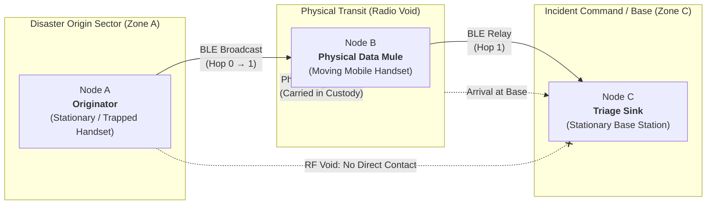

# MeshAid Physical Testbed Demonstration Protocol
## 3-Node Store-Carry-Forward Delay-Tolerant Network (DTN) Verification

- **Document Version**: `1.0.0`
- **Target Release**: MeshAid Phase 4 (`apps/mobile`)
- **Classification**: Verification & Operational Testbed Procedure
- **Target Hardware**: Minimum 3× Physical Android Handsets (API 26–34)

---

## 1. Protocol Overview & Objectives

### 1.1 Purpose
This protocol provides an end-to-end operational procedure to demonstrate and physically validate **connectionless, zero-infrastructure Store-Carry-Forward Delay-Tolerant Networking (DTN)** using off-the-shelf Android smartphones.

The demonstration proves that mission-critical emergency alerts can traverse partitioned disaster zones without cellular infrastructure, Wi-Fi access points, satellite uplinks, or peer-to-peer pairings.

### 1.2 Core Architectural Invariants
Every phase of this test enforces the following core architectural invariants:
1. **Zero Infrastructure Reliance**: Radio transceivers are restricted strictly to Bluetooth Low Energy (BLE). Cellular data, Wi-Fi, and external network gateways remain disabled (Airplane Mode active).
2. **Deterministic Non-AI Pipeline**: Packet ingestion, deduplication, triage prioritization, and relay scheduling operate purely through deterministic protocol rules and binary state machines.
3. **Cryptographic Integrity & Tamper-Evidence**: Emergency messages carry non-malleable 64-byte Ed25519 digital signatures and SHA-256 payload checksums. Any payload tampering at a relay node invalidates verification.
4. **Bounded Epidemic Routing**: Store-and-forward propagation is constrained by strict Time-To-Live (TTL) deadlines, maximum hop limits (`maxHops = 7`), and atomic deduplication (`SeenPacketEntity`).
5. **Deterministic Priority Queueing**: Persistent queues in SQLite (Room) strictly prioritize authority and life-safety traffic ($P0 > P1 > P2 > P3$).

---

## 2. Hardware Topology & Node Roles

The testbed requires three physical Android handsets positioned across two isolated physical zones separated by a radio void exceeding maximum BLE transmission distance ($d > 50\text{ meters}$ with physical barriers).



### 2.1 Node Specifications

| Node ID | Designation | Operational Role | Physical Location | Radio Exposure |
| :--- | :--- | :--- | :--- | :--- |
| **Node A** | **Disaster Originator** | Generates $P1\text{ SOS}$ emergency dispatch containing headcount and situation notes. | Sector Alpha (e.g., Room 101, basement, or field site). | Static. In range of Node B only during encounter. Never in direct range of Node C. |
| **Node B** | **Physical Data Mule** | Discovers Node A's beacon, ingests packet into Room DB custody, physically moves across the RF void, and broadcasts to Node C. | Mobile responder/civilian walking from Sector Alpha to Base. | Transient. Moves between Zone A and Zone C. |
| **Node C** | **Base / Triage Sink** | Ingests relayed packet, validates Ed25519 signature, renders high-visibility triage bulletin, and suppresses duplicate loops. | Sector Base (e.g., Command Tent / Medical Triage). | Static. In range of Node B only upon arrival. Never in direct range of Node A. |

---

## 3. Pre-Flight Configuration Checklist

Perform these steps on all three physical devices (**Node A**, **Node B**, and **Node C**) prior to initiating the test:

```
[ ] Step 1: Install apps/mobile/app/build/outputs/apk/debug/app-debug.apk
[ ] Step 2: Put device into Airplane Mode (Settings > Network > Airplane Mode = ON)
[ ] Step 3: Turn Bluetooth ON (Settings > Connected devices / Bluetooth = ON)
[ ] Step 4: Ensure Wi-Fi remains strictly OFF
[ ] Step 5: Ensure Mobile Data remains strictly OFF
[ ] Step 6: Launch MeshAid from launcher
[ ] Step 7: Grant all requested runtime permissions:
            - Nearby devices / Bluetooth Scan (android.permission.BLUETOOTH_SCAN)
            - Bluetooth Advertise (android.permission.BLUETOOTH_ADVERTISE)
            - Bluetooth Connect (android.permission.BLUETOOTH_CONNECT)
            - Location / Precise (android.permission.ACCESS_FINE_LOCATION)
            - Notifications (android.permission.POST_NOTIFICATIONS)
[ ] Step 8: On RelayDashboardScreen, verify persistent toggle is ON:
            - Status badge: "RELAY ENGINE RUNNING" (Green pulsing indicator)
            - Notification drawer shows ongoing "MeshAid Emergency Relay Active"
[ ] Step 9: Verify initial telemetry:
            - Packets in Custody = 0
            - Dedup Cache Size = 0
            - Bulletins list: "No Packets in Custody"
```

---

## 4. Step-by-Step Test Execution

```mermaid
sequenceDiagram
    autonumber
    participant A as Node A (Origin)
    participant B as Node B (Data Mule)
    participant C as Node C (Base Sink)

    Note over A,C: Pre-Flight: All devices offline (Airplane Mode ON, Bluetooth ON)
    Note over A,C: Node A and Node C are positioned >50m apart (RF Void)

    rect rgb(40, 20, 25)
    Note over A: Phase 1: Originator Broadcast (Zone A)
    A->>A: User triggers SOS Dispatch (P1, Headcount: 2, Notes)
    A->>A: Ingests to Room DB (Hop: 0, isRelayed: false)
    A->>A: BLE Advertiser starts cyclic broadcast (Service UUID: 0xa82f0000...)
    end

    rect rgb(20, 35, 45)
    Note over B: Phase 2: Custody Ingestion (Node B enters Zone A)
    B->>A: Scans BLE environment (ScanFilter matching 0xa82f0000...)
    A-->>B: Transmits wire packet (93B header + payload)
    B->>B: Validates packet TTL & checksum
    B->>B: Persists to Room DB (SeenPacketEntity inserted)
    B->>B: Increments hop count: 0 -> 1 for outbound relay
    B->>B: UI updates: Telemetry = 1 in custody, Red P1 badge
    end

    rect rgb(30, 30, 35)
    Note over B: Phase 3: Physical Transit Across RF Void
    B->>B: Physically departs Zone A (>50m away)
    Note over A,B: Node B is now out of range of Node A
    Note over B,C: Node B is not yet in range of Node C
    B->>B: Holds packet in SQLite custody (WakeLock + Foreground Service)
    end

    rect rgb(20, 45, 30)
    Note over C: Phase 4: Delivery & Sink Ingestion (Node B enters Zone C)
    B-->>C: BLE cyclic relay broadcast (Hop 1)
    C->>C: ScanFilter detects packet from Node B
    C->>C: Verifies 64B Ed25519 signature
    C->>C: Persists to Room DB & inserts SeenPacketEntity
    C->>C: Renders Red P1 SOS bulletin card on UI (Hops: 1)
    B-->>C: Subsequent BLE advertisement cycles received
    C->>C: Ingestion suppresses duplicate (IngestResult.DUPLICATE)
    end
```



### Phase 1: Emergency Origin (Node A)
1. **Positioning**: Place Node A at the designated disaster site (Zone A). Confirm Node C is stationed at Zone C (>50 meters away, behind concrete walls or out of line of sight).
2. **Dispatch SOS**:
   - On Node A, tap the red **`SOS DISPATCH`** Floating Action Button.
   - Select triage tier: **`P1 • SOS Emergency`**.
   - Set **Headcount**: `2`.
   - Enter **Urgent Situation Notes**: `Trapped under structural debris. 1 conscious, 1 bleeding heavily. Need extrication.`
   - Tap **`Broadcast Emergency`**.
3. **Telemetry Verification (Node A)**:
   - **`PACKETS IN CUSTODY`**: Increments to `1`.
   - **`DEDUP CACHE SIZE`**: Increments to `1`.
   - **`LIVE MESH BULLETINS`**: Displays `P1 SOS`, `ID: <hex_slice>...`, `IN CUSTODY`, `Hops: 0`.
4. **Negative Check (Node C)**:
   - Inspect Node C screen.
   - Verify `PACKETS IN CUSTODY` remains `0` and no bulletins appear, confirming genuine radio isolation between Node A and Node C.

---

### Phase 2: Opportunistic Ingestion by Physical Data Mule (Node B)
1. **Encounter**: Operator carrying Node B walks into Zone A (within 10 meters of Node A).
2. **Automatic Ingestion**:
   - Node B's `BleScannerManager` detects Node A's cyclic advertisement via `ScanFilter(0xa82f0000-1111-2222-3333-444455556666)`.
   - `MeshAidRepository.ingest()` atomically registers the packet ID in `SeenPacketEntity` and writes the wire bytes to `mesh_messages`.
   - Store-carry-forward mechanism increments `hopCount = 0 + 1 = 1` and registers the relay copy into the pending queue.
3. **Telemetry Verification (Node B)**:
   - **`PACKETS IN CUSTODY`**: Displays `1` (or `2` if both source and relay copies are tracked).
   - **`DEDUP CACHE SIZE`**: Displays `1`.
   - **`LIVE MESH BULLETINS`**: Renders Red `P1 SOS` badge with note: `"Trapped under structural debris..."`.
   - Badge displays `Hops: 0` (received) and schedules `Hops: 1` (outbound).

---

### Phase 3: Physical Transit Across Radio Partition
1. **Departure**: Operator carrying Node B leaves Zone A, walking through the RF void toward Zone C.
2. **Partition Verification**:
   - Verify Node B is out of radio range of Node A ($> 30\text{m}$ separation).
   - Observe that Node B's screen maintains the packet in custody.
   - Screen remains on or phone is put to sleep; foreground service notification `MeshAid Emergency Relay Active` guarantees Android Doze mode does not kill the process.

---

### Phase 4: Delivery, Signature Verification & Loop Suppression (Node C)
1. **Arrival**: Operator carrying Node B arrives at Base (Zone C, within 10 meters of Node C).
2. **Relay Ingestion on Node C**:
   - Node C's `BleScannerManager` captures Node B's relay advertisement.
   - `MeshAidPacketCodec.decodePacket()` parses the binary payload and validates:
     - Header size ($93\text{ bytes}$).
     - TTL deadline has not expired.
     - 64-byte Ed25519 digital signature matches packet bytes.
   - Node C persists the message and records the ID in `seen_packets`.
3. **Telemetry Verification (Node C)**:
   - **`PACKETS IN CUSTODY`**: Shows `1`.
   - **`DEDUP CACHE SIZE`**: Shows `1`.
   - **`LIVE MESH BULLETINS`**: Displays Red `P1 SOS` card:
     - Priority: `P1 SOS`
     - ID: Identical to Node A's message ID.
     - Hops: `Hops: 1` (proving it traversed intermediate Node B).
     - Payload: Complete situation notes and headcount `2`.
4. **Loop Suppression & Deduplication Verification**:
   - Keep Node B and Node C in proximity for 30 seconds while Node B continues cyclic advertising.
   - Observe Node C's `DEDUP CACHE SIZE`: Remains stable at `1`.
   - Observe Node C's bulletins list: No duplicate entries created.
   - Inspection of Logcat on Node C confirms `Duplicate suppressed: <messageId>`.

---

## 5. Pass/Fail Quality Gates

The test is certified as **PASSED** if and only if all of the following criteria are satisfied:

| Metric | Criterion | Validation Method | Result |
| :--- | :--- | :--- | :--- |
| **Zero Infrastructure** | 100% of test executed with Airplane Mode ON and Wi-Fi/Cellular disconnected. | Device visual state and system settings check. | [ PASS / FAIL ] |
| **Radio Isolation** | Node C receives zero packets while Node B is stationary outside Zone C. | Node C dashboard telemetry remains 0 before Node B arrives. | [ PASS / FAIL ] |
| **Store-Carry-Forward** | Packet physically travels from Zone A to Zone C via Node B's local storage. | Hop count on Node C displays `Hops: 1`. | [ PASS / FAIL ] |
| **Cryptographic Integrity** | 64-byte Ed25519 signature is verified without rejection. | No `PacketIntegrityException` in Node C logs. | [ PASS / FAIL ] |
| **Loop Suppression** | Duplicate cyclic advertisements from Node B do not create duplicate rows in Room. | Node C maintains exactly 1 row per packet ID; subsequent ingestions return `IngestResult.DUPLICATE`. | [ PASS / FAIL ] |
| **Triage Visibility** | Emergency priority badge renders in High-Visibility Red (`#EF4444`). | Jetpack Compose UI shows Red P1 badge. | [ PASS / FAIL ] |

---

## 6. Live Debugging & Telemetry Inspection

During live testing, operators can monitor internal state via ADB over USB or Wi-Fi debugging (on a separate debugging workstation).

### 6.1 Unified Logcat Filter
Run the following command on each connected handset to monitor the DTN pipeline in real-time:

```bash
# Filter for all MeshAid core transport and persistence tags
adb -s <DEVICE_SERIAL> logcat -v time -s \
    MeshRelayService:V \
    MeshAidRepository:V \
    BleScannerManager:V \
    BleAdvertiserManager:V \
    EmergencyViewModel:V
```

#### Expected Logcat Traces:

**Node A (Originator dispatch)**:
```text
I/MeshAidRepository: Ingested packet 4a8e1b2f0c7d3e91 (priority=CIVILIAN_SOS, ttl=172800)
I/MeshRelayService: Enqueued via repository: 4a8e1b2f0c7d3e91
I/MeshRelayService: Triggering immediate BLE broadcast: 4a8e1b2f0c7d3e91 (priority=1)
D/BleAdvertiserManager: Broadcasting 142 bytes via Extended Advertising
```

**Node B (Data Mule ingestion & transit)**:
```text
I/BleScannerManager: Packet discovered: 4a8e1b2f0c7d3e91 (Hops: 0, Priority: 1)
I/MeshAidRepository: Ingested packet 4a8e1b2f0c7d3e91 (priority=CIVILIAN_SOS, ttl=172800)
I/MeshRelayService: Relaying inbound packet: 4a8e1b2f0c7d3e91 (Hops: 0)
I/MeshAidRepository: Ingested packet 4a8e1b2f0c7d3e91 (priority=CIVILIAN_SOS, ttl=172800)
D/MeshRelayService: Cyclic broadcasting: 4a8e1b2f0c7d3e91 (priority=1)
```

**Node C (Triage Base reception & deduplication)**:
```text
I/BleScannerManager: Packet discovered: 4a8e1b2f0c7d3e91 (Hops: 1, Priority: 1)
I/MeshAidRepository: Ingested packet 4a8e1b2f0c7d3e91 (priority=CIVILIAN_SOS, ttl=172800)
D/MeshAidRepository: Duplicate suppressed: 4a8e1b2f0c7d3e91
```

### 6.2 SQLite Room Database Inspection via ADB Shell
Inspect database state directly on any test handset without installing root tools:

```bash
# Open interactive SQLite shell on device database
adb -s <DEVICE_SERIAL> shell "run-as dev.meshaid.app sqlite3 databases/meshaid.db"

# 1. View all packets in custody
sqlite> SELECT messageId, priority, hopCount, isRelayed, datetime(createdAt/1000, 'unixepoch', 'localtime') AS created FROM mesh_messages;

# 2. View deduplication cache
sqlite> SELECT messageId, datetime(firstSeenAt/1000, 'unixepoch', 'localtime') AS firstSeen FROM seen_packets;

# 3. Verify total pending count
sqlite> SELECT COUNT(*) FROM mesh_messages WHERE isRelayed = 0;
```

---

## 7. Field Test Troubleshooting & Anomaly Matrix

| Symptom | Probable Cause | Corrective Action |
| :--- | :--- | :--- |
| **Node B does not detect Node A** | Bluetooth scanning permission missing or Location disabled. | Verify `ACCESS_FINE_LOCATION` and `BLUETOOTH_SCAN` permissions are set to "Allow all the time". Check system Location master toggle is ON. |
| **Advertising fails (`status: 4`)** | BLE radio chip limit reached or another app holding advertiser sets. | Toggle Bluetooth OFF then ON in Android system settings. Restart `MeshRelayService` via dashboard switch. |
| **Legacy hardware cannot receive extended advertisements** | Device radio does not support BLE 5.0 Extended Advertising (`isLeExtendedAdvertisingSupported == false`). | MeshAid automatically falls back to 4-byte header manufacturer chunking (`BleConstants.MANUFACTURER_ID = 0xFFFF`). Ensure legacy scan filter is active. |
| **Packets killed while phone screen is OFF** | Android aggressive battery optimization / Doze mode suspending process. | Go to Android Settings > Apps > MeshAid > Battery > select **"Unrestricted"**. Verify foreground service notification is permanently pinned. |
| **Signature verification error** | Byte buffer serialization mismatch during wire encoding. | Verify both sender and receiver use identical `MeshAidPacketCodec.HEADER_SIZE = 93` and UTF-8 charset. |

---

## 8. Certification Sign-Off

Upon successful completion of all quality gates in Section 5, record physical test execution results below:

- **Date of Execution**: `____________________`
- **Location / Sector**: `____________________`
- **Node A Device Model / Android OS**: `____________________`
- **Node B Device Model / Android OS**: `____________________`
- **Node C Device Model / Android OS**: `____________________`
- **Measured Transit Distance (Zone A to Zone C)**: `______ meters`
- **Lead Test Engineer**: `____________________`
- **Final Result**: `[ ] CERTIFIED PASSED  /  [ ] REJECTED`
